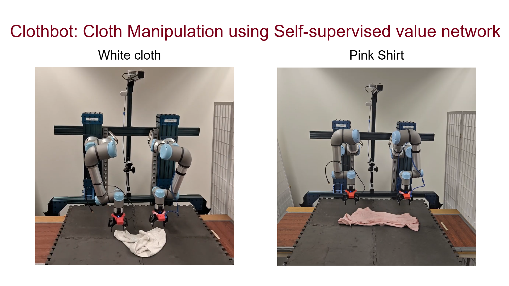
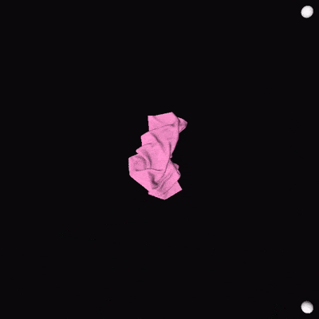

# Cloth Manipulation using Self-supervised value network
	
[comment]: <>  (## _The Last Markdown Editor, Ever_)

<!--  -->

## Demo

Video Link: [Demo](https://youtu.be/vcyFeuL4r6w?si=Km419zFCMDmrSFIV)

Rollout 1            |  Rollout 2
:-------------------------:|:-------------------------:
  |  

## Abstract
Cloth manipulation is a challenging problem due to cloth’s complex dynamics, almost infinite DoF and severe self-occlusion. Moreover, most cloth manipulation tasks require chaining of multiple action primitives such pick, place, drag fling, stretch, etc. In addition, most of the current cloth manipulation research only use quasi-static actions taking large amount of time to manipulate different garments. Thus our project aims to tackle this complex manipulation problem by imparting the capability of dynamic cloth unfolding to a bimanual robot using a high- velocity dynamic fling action. We focus particularly on the task of cloth unfolding, a typical first step in most cloth manipulation tasks. We trained our self-supervised Value network policy based on Spatial Action Maps. The policy is completely trained on only rectangular cloths in simulation. We have leveraged Softgym simulator and have trained the policy for 7 days until convergence. The policy achieves a cloth unfolding mean coverage of 95.09% over 200 rollouts on rectangular cloths. Interestingly our policy also generalizes to unseen cloths such as T-shirts while achieving the mean coverage of 87.66%. It also transfers to the real-world cloths in a zero-shot manner without any need of fine-tuning. Real-world results are evaluated on a UR5e dual-arm robot.     

## Poster

### Acknowledgement

+ This work is the re-implementation of the below paper, so if you find it useful please cite the Flingbot paper: 
    + "Flingbot: The unreasonable effectiveness of dynamic manipulation for cloth unfolding.", Ha, Huy, and Shuran Song, In Conference on Robot Learning, pp. 24-33. PMLR, 2022.

+ Other References:
    + “Unfolding the literature: A review of robotic cloth manipulation.”, Longhini, Alberta et al, Annual Review of Control, Robotics, and Autonomous Systems 8, 2024. 
    + "Speedfolding: Learning efficient bimanual folding of garments.", Avigal, Yahav, Lars Berscheid, Tamim Asfour, Torsten Kröger, and Ken Goldberg, In 2022 IEEE/RSJ International Conference on Intelligent Robots and Systems (IROS), pp. 1-8. IEEE, 2022.
    + “Softgym: Benchmarking deep reinforcement learning for deformable object manipulation”,Xingyu Lin, Yufei Wang, Jake Olkin, and David Held, Conference on Robot Learning, 2020. 
    + “Learning particle dynamics for manipulating rigid bodies, deformable objects, and fluids.”, Li, Y., Wu, J., Tedrake, R., Tenenbaum, J., & Torralba, A. (2018). arXiv:1810.01566

### License

MIT

